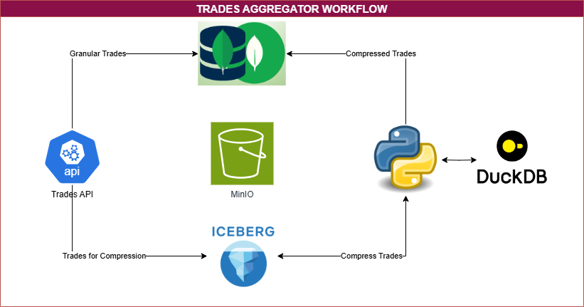

<p align="center">
    <a href=""></a>
</p>
<p align="center">
    <em>Trade Aggregator PoC</em>
</p>

# PYICEBERG, DUCKDB & MINIO PoC

## USE CASE


Post-Trade Venue XYZ has implemented an API that allows trading members to submit trades in real-time. These trades are immediately fed into the trading venue's system and are aggregated both intra-day and at the end of the day to calculate net exposures for each trading participant.

Trading participants can engage in both buying and selling activities, resulting in long and short positions. Consequently, their overall exposure to Trading Venue XYZ can fluctuate significantly throughout the day, leading to positions of varying sizes and directions.

To effectively manage risk and operations, it's crucial to monitor these positions at both granular and aggregated levels. This monitoring enables the computation of key business, risk, and operational metrics.
To address these requirements, the Tech and Quant team has designed a sophisticated infrastructure with the following components:

- FastAPI API: Serves as the entry point for trade submissions to Post-Trade Venue XYZ.
- MongoDB: Stores individual trade transactions at a granular level, providing a comprehensive backlog of all trades. MongoDB's time series collections are particularly well-suited for this purpose, offering efficient storage and querying of time-based data.
- MinIO Data Lake: Hosts a flexible and scalable object storage solution, ideal for storing large volumes of trade data.
- Apache Iceberg: Utilized for efficient data organization and aggregation within the MinIO data lake. It allows for daily aggregation of trades, leveraging its advanced partitioning and metadata management capabilities.

Data Flow:
- Trades are submitted via the FastAPI API.
- Raw trade data is stored in MongoDB for long-term persistence.
- Data is also sent to the MinIO data lake.
- Apache Iceberg is used to aggregate trades on a daily basis within the data lake.
- Aggregated results are stored back in MongoDB for quick access and analysis.

It's important to note that while MongoDB serves as the long-term persistent storage for both raw and aggregated data, the MinIO data lake and Apache Iceberg handle non-persistent data primarily for efficient compression and aggregation purposes. This approach allows for fast and flexible data processing while maintaining a comprehensive historical record of all transactions.

## FULL STACK

<p align="center">
    <a href=""></a>
</p>
<p align="center">
    <em>Full Stack Flow Schema</em>
</p>


This handout provides an overview of three key technologies in modern data lake architecture: MinIO, Apache Iceberg, and DuckDB with PyIceberg.

### MinIO

MinIO is a high-performance, cloud-native object storage system designed for scalability and efficiency7. It offers a unified storage solution for modern data lakes that can run anywhere, including private clouds, public clouds, and bare metal environments.

MinIO stands out as an innovative solution for structuring data lakes due to its:

- Cloud-native design, enabling multi-cloud and hybrid-cloud deployments.
- Use of erasure coding, providing better storage efficiency and resiliency compared to traditional Hadoop clusters.
- Optimizations for small files, which aligns well with data lake formats like Delta Lake and Iceberg4.

As an object storage solution for Iceberg, MinIO offers several advantages:

- **Active** active replication for multi-geo resiliency and fast failover4.
- **Efficient** handling of small files, which is crucial for Iceberg's transaction logs and metadata files.
- **Compatibility** with cloud object stores like Amazon S3, allowing for seamless integration with existing cloud infrastructure.

### Apache Iceberg

Apache Iceberg is an open-source table format for large analytic datasets, designed to improve upon older systems like Hive.

Key features of Apache Iceberg include:

- File-level data tracking, improving efficiency on object storage systems.
- Advanced metadata management, allowing for faster updates and deletes.
- Snapshot-based versioning, enabling time travel and rollback capabilities.

Iceberg has largely replaced Hive in modern object storage-based data lakes for several reasons:

- Better performance: Iceberg's design eliminates inefficient list operations that slow down Hive on object storage.
- Improved data consistency: Iceberg's file-level tracking prevents issues with missing data that can occur with Hive's folder-level approach.
- More efficient partitioning: Iceberg uses a more granular partition strategy, allowing for faster query performance.

### DuckDB & PyIceberg

DuckDB is an in-process SQL OLAP database management system, designed for fast analytical queries on local datasets.

Using DuckDB in combination with PyIceberg offers several advantages for aggregating large volumes of data:

- Local querying: DuckDB allows for running queries locally on Iceberg tables, reducing the need for expensive cloud compute resources.
- Efficient data loading: PyIceberg can efficiently scan Iceberg tables and load only the necessary data into DuckDB for processing.
- SQL interface: DuckDB provides a familiar SQL interface for querying data loaded from Iceberg tables.
- Performance optimization: DuckDB can materialize tables in memory for improved query performance on large datasets.


By combining these technologies, data engineers and analysts can build efficient, scalable data lake solutions that leverage the strengths of object storage, modern table formats, and fast local query engines.

## APPLICATION LAUNCH

To launch the services needs to test this orchestration, it requires the user to cd in this git repository and run from the command line:

```bash

docker compose up --build -d python_ice

```